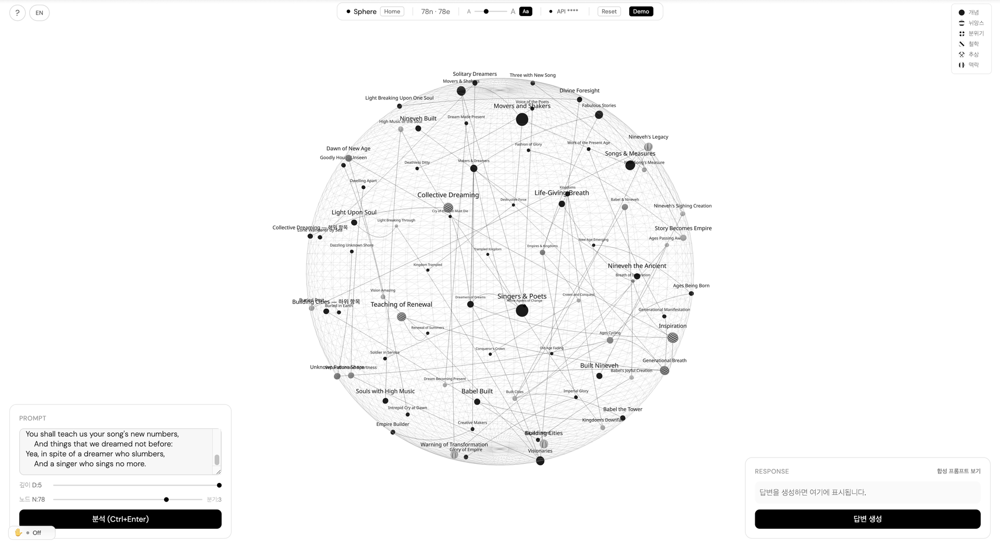
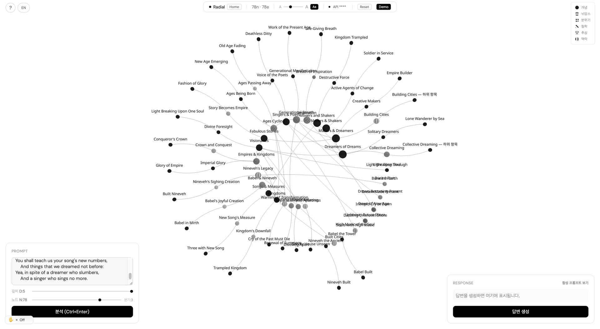
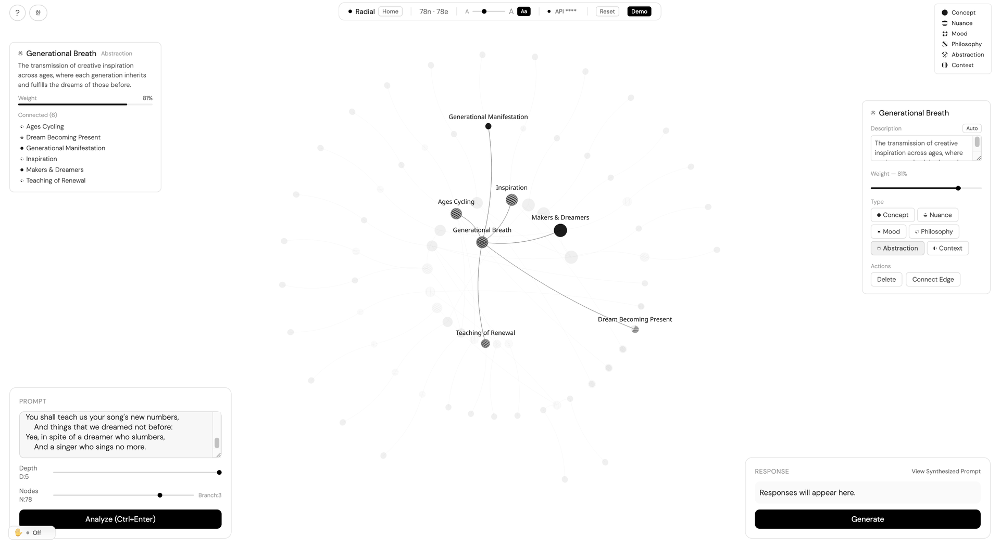
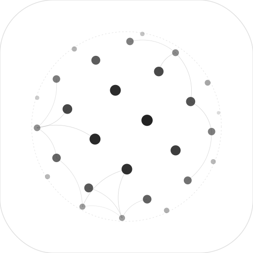

# NodePrompt

**인터랙티브 개념 그래프를 통한 공간적 프롬프트 엔지니어링**

<p align="center">
  
  
  
  
  &nbsp;
  
  
  
  
  &nbsp;
  
  
  
  
  
  
</p>

프롬프트 — 텍스트, 이미지, 또는 PDF — 를 AI가 다차원 개념 그래프로 분해하여 3D 구 표면에 배치하고, 사용자가 공간적으로 재구성한 뒤 구조화된 프롬프트로 재합성하여 더 높은 품질의 AI 응답을 생성합니다.

> *"사고는 비선형이다. 언어는 선형이다. 구의 표면이 그 간극을 메운다."*

[English README](./README.md)

<p align="center">
  <video src="https://github.com/user-attachments/assets/388508da-4304-456e-a41e-19b30b890bff" width="100%" autoplay loop muted playsinline></video>
</p>

<p align="center">
  
</p>


---

## NodePrompt가 필요한 이유

기존 프롬프트 엔지니어링은 블랙박스입니다. 텍스트를 입력하고, 응답을 받고, 맹목적으로 반복합니다. NodePrompt는 프롬프트의 *구조*를 시각화하고 편집 가능하게 만듭니다.

| 기존 프롬프팅 | NodePrompt |
|---|---|
| 선형 텍스트 입출력 | 프롬프트를 개념 그래프로 분해 |
| 불투명한 추론 과정 | 노드 가중치, 타입, 관계가 시각적으로 표현 |
| 수동 반복 수정 | 공간 편집: 드래그, 가중치 조절, 관계 재연결 |
| 단일 관점 | 6가지 인지 차원 동시 추출 |

핵심 혁신은 **인간-AI 공동 분해(Co-Decomposition)**: AI가 개념 구조를 제안하고, 인간이 공간적으로 재구성한 뒤, AI가 재합성합니다 — 지식구조 이론에 기반한 순환적 협업 루프입니다.

---

## 이론적 기반

NodePrompt의 설계는 인지과학, 지식 표현, 정보 시각화 분야의 검증된 연구에 기반합니다.

### 인지 구조

- **Rosch의 기본 수준 범주화** (1976) — 추출 시스템은 가장 밀도 높은 노드 레이어를 깊이 2(기본 수준)에 배치합니다. 인간 인지가 가장 효율적으로 작동하는 수준입니다. 상위 주제는 위에, 하위 세부사항은 아래에 위치합니다.
- **Miller의 법칙 (7 +/- 2)** (1956) — 각 부모 노드의 자식 수를 ~7개로 제한하여 작업 기억 용량을 존중합니다. 분기 계수는 `min(7, ceil(N^(1/D)))`로 계산됩니다.
- **Hayakawa의 추상 사다리** (1939) — 깊은 계층일수록 추상도가 낮아집니다. 루트 테마가 가장 추상적이고, 리프 노드가 가장 구체적인 사례입니다.

### 지식 표현

- **Ranganathan의 패싯 분류법** (1933) — 노드는 단일 분류 체계가 아닌 독립적 패싯(인지 유형, 인식론적 입장, 수사학적 역할)을 가집니다. "분위기" 노드가 어떤 깊이에든 나타날 수 있습니다.
- **Novak의 개념 매핑** (1972) — 트리 엣지뿐 아니라 가지 간 교차 엣지에서 진정한 통찰이 생깁니다. 6가지 관계 유형을 지원합니다: `인과`, `대비`, `증폭`, `억제`, `병렬`, `의존`.
- **TopicGPT 다단계 추출** (2024) — 다단계 추출이 단일 추출보다 더 정확한 개념 그래프를 생성합니다. NodePrompt는 3단계 파이프라인을 사용합니다: 골격 → 채우기 → 검증.

### 시각화 이론

- **Munzner의 H3 쌍곡 레이아웃** (1997) — Interior 모드는 Poincare 볼 근사를 사용하여 중심 노드는 크게, 주변 노드는 압축 표시하여 초점+맥락 탐색이 가능합니다.
- **Lombardi 네트워크 미학** — 모든 엣지는 교대 방향의 Bezier 곡선으로 렌더링됩니다. Mark Lombardi의 네트워크 다이어그램 스타일: 흰 배경에 검은 선, 무색, 무그림자, 기하학적 정밀함.

### 프롬프트 엔지니어링 연구

- **Chain-of-Symbol (CoS) 프롬프팅** — 구조화된 기호 표현(노드 타입, 가중치, 관계)이 재합성 시 LLM의 공간적 추론을 개선합니다.
- **시각적 프롬프트 엔지니어링** — 텍스트는 변환과 목표 설명에 강하고, 공간 레이아웃은 관계와 상대적 중요도 전달에 강합니다. NodePrompt는 두 양식을 결합합니다.

---

## 기능

### 세 가지 인터랙션 모드

```
            [Sphere 모드]
          구 표면 위 3D 조감
         /        |         \
     Space    더블클릭     스크롤 줌
        \        |          /
       [Radial 모드]   [Interior 모드]
      동심원 링 위      구 내부
      2D 편집          어안 렌즈 탐색
```

**Sphere 모드** — 피보나치 격자로 구 표면에 노드 분포. 궤도 회전, 줌, 클릭으로 전체 개념 그래프를 한눈에 탐색합니다.

**Radial 모드** — 2D 편집 작업 공간. 계층 깊이별 동심원 링에 노드 배치 (최대 5개 링). 드래그, 가중치 조절, 엣지 생성이 가능합니다.

<p align="center">
  
</p>

**Interior 모드** — 구 내부에서의 몰입형 어안 뷰. 쌍곡 스케일링(Poincare 볼 모델)으로 가까운 노드는 크게, 먼 노드는 작게 표시됩니다.

모드 전환은 `Space` 또는 더블클릭. 모든 전환은 노드 아이덴티티를 보존하는 부드러운 GSAP 모프입니다.

### 여섯 초월자(Transcendentia) 차원

NodePrompt의 여섯 노드 타입은 토마스 아퀴나스가 *De Veritate* q.1 a.1에서 제시한 여섯 초월자(*transcendentia*)입니다. 범주를 초월하여 존재자(*ens*) 자체에 적용되는 여섯 가지 형이상학적 물음이며, 모든 프롬프트는 같은 텍스트에 대해 서로 다른 여섯 개의 질문을 던지는 방식으로 읽힙니다:

| 라틴어 — UI | 뜻 | 묻는 질문 | 1차 대응 |
|---|---|---|---|
| **ens** — 존재 | *id quod est* — 있는 그것 | 이 프롬프트는 무엇을 '있다'고 정립하는가? | 핵심 주체, 주제, 지시 대상 |
| **res** — 본질 | *quod habet quidditatem* — 무엇임을 가진 것 | 그것은 형식적 구조로서 무엇인가? | 정의, 메커니즘, 상위 패턴 |
| **unum** — 통일 | *ens indivisum* — 자기 안에서 분할되지 않음 | 무엇이 그것을 하나로 붙들고 있는가? | 상황, 청중, 통일적 맥락, 프레임 |
| **aliquid** — 차이 | *aliud-quid* — 다른 것과 다른 것 | 그것은 그것이 아닌 것과 어떻게 구별되는가? | 행간, 대조, 암묵적 긴장, 뉘앙스 |
| **verum** — 진리 | *ens ut cognoscibile* — 지성에 대해 인식될 수 있는 존재 | 그것은 인식자에게 어떻게 참인가? | 세계관, 인식·윤리적 입장, 철학 |
| **bonum** — 가치 | *ens ut appetibile* — 의지에 대해 욕구될 수 있는 존재 | 그것은 의지에 어떻게 욕구되는가? | 톤, 분위기, 정서적 하중, 가치 |

여섯 초월자는 여섯 '종류'의 존재가 아니라 같은 존재의 여섯 '측면'입니다 — "convertibilia cum ente" (존재 자체와 서로 바꿀 수 있는 것). 하나의 개념은 어떤 레지스터로도 읽힐 수 있으며, 선택된 레지스터는 렌즈이지 내용이 아닙니다. 각 타입은 고유한 패턴 텍스처로 구별되며 (Lombardi 스타일: 무색, 패턴만으로 구분), 도움말 오버레이(`?` 버튼)에 전체 매핑과 예시 질문이 포함되어 있습니다.

### 멀티모달 프롬프트

프롬프트에 이미지와 PDF를 직접 첨부할 수 있습니다 — 추출 파이프라인이 텍스트와 함께 읽습니다. 텍스트 영역 아래 드롭존에 드래그 앤 드롭, 클릭, 혹은 붙여넣기 할 수 있습니다.

| 쓰임새 | 첨부할 것 | 얻게 되는 것 |
|---|---|---|
| 논문 | PDF | 논증 분해 — 전제, 방법, 주장이 유형화된 노드로 |
| 화이트보드 / 노트 스케치 | 사진 | 화살표는 엣지, 군집은 계층, 손글씨는 라벨로 |
| UI 목업 / 디자인 추출본 | 이미지 / Figma PNG | 디자인 표면이 여섯 초월자 레지스터로 정렬 |
| 아키텍처 / 플로우 다이어그램 | 이미지 | 구조를 산문으로 풀지 않고 구조로서 읽음 |
| 차트 / 플롯 | 이미지 | 양, 관계, 함의된 주장이 노드로 |

첨부가 있을 때 텍스트는 선택적이며, 텍스트가 *있을* 때는 첨부를 *어느 각도에서* 읽을지를 지정합니다 (예: "여기서 방법론적 입장은 무엇인가" vs. "이것이 실천에 주는 함의는 무엇인가").

용량 한도: 이미지당 5 MB (JPEG/PNG/WebP/GIF), PDF당 10 MB. 지원은 프로바이더별로 다릅니다:

| 프로바이더 | 이미지 | PDF |
|---|---|---|
| Anthropic Claude | 지원 | 지원 |
| Google Gemini | 지원 | 지원 |
| OpenAI GPT | 지원 | 미지원 |
| xAI Grok | 지원 | 미지원 |
| DeepSeek | 미지원 | 미지원 |
| Alibaba Qwen | 미지원 | 미지원 |

활성 프로바이더를 전환하면 드롭존이 즉시 새 프로바이더의 가능성 집합으로 다시 연결됩니다. 지원되지 않는 파일은 네트워크 호출 이전 UI 단에서 명시적 에러 메시지와 함께 거절됩니다.

### 인터랙티브 그래프 편집

- **클릭** — 노드 포커싱. 연결된 노드가 강조되고 나머지는 부드럽게 페이드
- **재클릭** — 포커싱 해제 (그라데이션 전환)
- **드래그** — Radial 모드에서 노드 위치 재배치
- **스크롤 휠** — 노드 위에서 가중치(중요도) 조절
- **Shift+클릭** — 두 노드 순서대로 클릭하여 엣지 생성
- **우클릭** (빈 공간) — **노드 추가** (Sphere, Radial 모두 지원)
- **우클릭** (선택된 노드) — 컨텍스트 메뉴 (타입 변경, 삭제, 엣지 연결)
- **라벨 더블클릭** — 패널에서 노드 이름 인라인 수정
- **편집 패널** (우측) — 이름 수정, 설명 편집 + **Auto** AI 자동 생성 버튼, 가중치 슬라이더, 타입 선택기, 삭제/엣지 액션
- **정보 패널** (좌측) — 이름 수정, 설명, 연결 노드 목록, 가중치 바, 클릭 내비게이션

<p align="center">
  
</p>

### 핸드 제스처 컨트롤

[MediaPipe](https://ai.google.dev/edge/mediapipe/solutions/vision/gesture_recognizer) 핸드 트래킹을 활용한 웹캠 기반 핸즈프리 인터랙션을 지원합니다. 좌측 하단의 제스처 토글 버튼으로 활성화합니다.

| 제스처 | 동작 |
|---|---|
| **손바닥 펴고 드래그** | 손 움직임으로 3D 구 회전 |
| **주먹 쥐기** | 회전 즉시 정지 |
| **손 제거** | 관성으로 감속하며 회전 유지 |
| **손 크기 변화** | 카메라에 가까이 → 줌 인 / 멀리 → 줌 아웃 |

~15fps 추론 + 1-Euro 필터로 부드럽고 떨림 없는 트래킹을 제공합니다. 구 표면 위 링 커서가 실시간 시각 피드백을 제공하며, 오버레이에서 미니 웹캠 프리뷰를 토글할 수 있습니다.

### 합성 프롬프트 파이프라인

```
  사용자 프롬프트
       |
       v
  [3단계 AI 추출]
  골격 -> 채우기 -> 검증
       |
       v
  개념 그래프 (편집 가능)
  - 깊이별 계층 구조
  - 가중치 부여된 노드 (0-1)
  - 유형화된 관계
       |
       v
  [프롬프트 합성기]
  그래프 → 구조화된 프롬프트:
    - 노드 계층 & 가중치 반영
    - 엣지 관계 반영
    - 삭제된 관점 (제외로 명시)
    - 가지 간 교차 연결
       |
       v
  [AI 응답 생성]
  더 높은 품질, 더 섬세한 출력
```

---

## 시작하기

### 사전 요구사항

- Node.js 18+
- 지원되는 6개 프로바이더 중 최소 하나의 API 키:
  - [Anthropic Claude](https://console.anthropic.com/) · [OpenAI GPT](https://platform.openai.com/) · [Google Gemini](https://aistudio.google.com/)
  - [xAI Grok](https://console.x.ai/) · [DeepSeek](https://platform.deepseek.com/) · [Alibaba Qwen (DashScope)](https://dashscope.console.aliyun.com/)

### 설치

```bash
git clone https://github.com/TaewoooPark/NODEPROMPT.git
cd NODEPROMPT
npm install
npm run dev
```

### 프로바이더 & API 키 설정

NodePrompt는 통합 프로바이더 레이어를 통해 **6개의 LLM 프로바이더**와 통신합니다. 보유한 키의 프로바이더를 고르면 구조화 추출, 스트리밍, 설명 생성이 모두 동일하게 동작합니다.

| 프로바이더 | Fast (추출) | Flagship (생성) |
|---|---|---|
| **Anthropic** | Claude Haiku 4.5 | Claude Sonnet 4.6 |
| **OpenAI** | GPT-5.4 Mini | GPT-5.4 |
| **Google** | Gemini 2.5 Flash | Gemini 3.1 Pro |
| **xAI** | Grok 4.1 Fast | Grok 4.1 Fast Reasoning |
| **DeepSeek** | DeepSeek V3.2 Chat | DeepSeek Reasoner |
| **Alibaba** | Qwen3.5 Flash | Qwen3 Max |

**방법 A — 브라우저 (권장)**
1. `npm run dev` 실행 후 로컬 URL 접속
2. 상단 툴바의 프로바이더 드롭다운 클릭 (모노톤 로고 + 활성 프로바이더 이름 표시)
3. 프로바이더 선택 — 해당 프로바이더의 플래그십 모델이 콘솔에서 추가 활성화를 요구하는 경우(OpenAI Verified Organization, Gemini 결제 활성화, Qwen 모델별 신청), 드롭다운 옆에 한영 이중 언어 안내 팝업이 나타납니다
4. **API** 버튼을 눌러 선택한 프로바이더용 키 입력 (`****`로 마스킹, `localStorage`에만 저장). 프로바이더별로 슬롯이 분리되어 여러 키를 동시에 보관할 수 있습니다.

**방법 B — 환경 변수**
```bash
cp .env.example .env
# 사용할 프로바이더만 입력하면 됩니다(나머지는 비워도 무방):
# VITE_ANTHROPIC_API_KEY=sk-ant-...
# VITE_OPENAI_API_KEY=sk-...
# VITE_GEMINI_API_KEY=AIza...
# VITE_XAI_API_KEY=xai-...
# VITE_DEEPSEEK_API_KEY=sk-...
# VITE_QWEN_API_KEY=sk-...
```

브라우저 입력 키가 `.env`보다 우선합니다. 기존 단일 키(`nodeprompt_api_key`)는 첫 실행 시 Anthropic 슬롯으로 자동 마이그레이션됩니다.

> **참고:** 6개 프로바이더 모두 CORS 우회를 위해 Vite 개발 서버 프록시를 경유합니다. 이 설정은 로컬 개발(`npm run dev`) 전용이며, 프로덕션 배포 시에는 별도 백엔드 프록시가 필요합니다.

### 빠른 시작

1. 하단 입력창에 프롬프트 입력 (예: *"인공지능이 창작 산업에 미치는 영향"*) — 혹은 드롭존에 이미지 / PDF를 떨어뜨리기 (텍스트 유무 무관)
2. **N** (노드 수, 5–50)과 **D** (깊이, 1–5) 슬라이더 조절
3. **Extract** 클릭 — AI가 프롬프트(와 첨부)를 구 표면의 개념 그래프로 분해
4. `Space`를 눌러 Radial 모드 진입
5. 노드 드래그, 가중치 조절, 불필요한 개념 삭제, 새 엣지 생성
6. **Synthesize** 클릭 — 편집된 그래프에서 구조화된 프롬프트 생성
7. **Generate** 클릭 — 공간 편집이 반영된 AI 응답 수신
8. 또는 **Demo** 클릭으로 미리 구축된 50노드 그래프 탐색

---

## 조작법

| 동작 | 입력 |
|---|---|
| Sphere / Radial 전환 | `Space` 또는 더블클릭 |
| 노드 선택 / 포커싱 | 클릭 |
| 포커싱 해제 | 같은 노드 재클릭 또는 `Esc` |
| 노드 드래그 (Radial) | 드래그 |
| 가중치 증가 | `]` `+` |
| 가중치 감소 | `[` `-` |
| 가중치 조절 (Radial) | 노드 위 스크롤 휠 |
| 노드 추가 | 빈 공간 우클릭 (Sphere / Radial) |
| 노드 이름 수정 | 패널에서 라벨 더블클릭 |
| 설명 자동 생성 | 편집 패널에서 **Auto** 클릭 |
| 엣지 생성 | `Shift+클릭` 소스 → 타겟 |
| 엣지 생성 취소 | `Esc` |
| 노드 삭제 (Radial) | `Backspace` |
| 라벨 토글 | `L` |
| 카메라 홈 | `H` |
| Undo / Redo | `Ctrl+Z` / `Ctrl+Shift+Z` (Mac: `Cmd+Z` / `Cmd+Shift+Z`) |
| 도움말 오버레이 | `?` |
| **핸드 제스처** | |
| 제스처 컨트롤 토글 | 좌측 하단 토글 버튼 |
| 구 회전 | 손바닥 펴고 드래그 |
| 회전 정지 | 주먹 쥐기 |
| 줌 인 / 아웃 | 손을 카메라에 가까이 / 멀리 |

---

## 아키텍처

### 기술 스택

| 레이어 | 기술 |
|---|---|
| 렌더링 | React Three Fiber + Three.js (InstancedMesh) |
| 애니메이션 | GSAP (100+ 노드 단일 트윈 모프) |
| 상태 관리 | Zustand (Map + Array 이중 구조) |
| 레이아웃 | D3-hierarchy (방사형 링), Fibonacci 격자 (구면) |
| LLM API | Anthropic / OpenAI / Gemini / xAI / DeepSeek / Qwen 통합 프로바이더 레이어 (Vite 프록시 경유) |
| 제스처 | MediaPipe Hand + 1-Euro 필터 |
| 검증 | Zod 스키마 검증 + 재시도 |
| 스타일 | Lombardi 미학 (DM Sans, IBM Plex Sans) |
| 빌드 | Vite + TypeScript |

### 성능

- **InstancedMesh** — 타입별 단일 드로우 콜. 100+ 노드에서 부드러움, 10,000+까지 가능.
- **애니메이션 중 React re-render 0회** — 모든 위치 업데이트는 `useFrame`에서 Zustand 스토어 직접 읽기.
- **배치 엣지 렌더링** — 단일 `LineSegments` + `BufferGeometry` + `Float32Array`로 모든 엣지 처리.
- **캐시된 하이라이트 상태** — 연결 노드 셋을 포커스 변경당 1회 계산, 프레임당 컴포넌트 간 재사용.

### 데이터 모델

```typescript
interface NodeData {
  id: string;
  label: string;
  type: 'ens' | 'res' | 'unum' | 'aliquid' | 'verum' | 'bonum';  // 아퀴나스, De Veritate q.1 a.1
  weight: number;              // 0–1 중요도 점수
  description: string;
  depth: number;               // 0=루트, 1=테마, 2=기본, 3+=세부
  abstractionLevel: 'superordinate' | 'basic' | 'subordinate' | 'instance';
  parentId: string | null;
  children: string[];
  position: { x, y, z };
  sphereCoord: { theta, phi };
  radialCoord: { angle, depth };
}

interface EdgeData {
  id: string;
  sourceId: string;
  targetId: string;
  relation: 'causal' | 'contrast' | 'amplify' | 'suppress' | 'parallel' | 'dependency';
  strength: number;            // 0–1
  isHierarchical: boolean;
}
```

### 프로젝트 구조

```
src/
├── components/           # 3D 씬 + UI 컴포넌트
│   ├── Scene.tsx             캔버스, 조명, 후처리
│   ├── SceneInner.tsx        모드 라우팅, 모프 전환
│   ├── SphereInstancedView   InstancedMesh + LOD 라벨 (Sphere/전환 중)
│   ├── InteriorView.tsx      쌍곡 어안 InstancedMesh
│   ├── DraggableNode.tsx     Radial 드래그/가중치/엣지 인터랙션
│   ├── EdgeRenderer.tsx      통합 Bezier 엣지 렌더러 (useFrame, re-render 0회)
│   ├── NodeInfoPanel.tsx     좌측 패널: 설명 + 연결 노드
│   ├── NodeEditPanel.tsx     우측 패널: 가중치 슬라이더 + 타입 + 액션
│   ├── HandGestureOverlay.tsx 웹캠 제스처 토글 + 상태 표시
│   ├── HandCursor.tsx        구 표면 위 3D 링 커서
│   ├── HelpOverlay.tsx       ? 버튼 + 키보드 단축키 레퍼런스
│   ├── PromptInput.tsx       프롬프트 입력 + N/D 슬라이더
│   ├── ResponsePanel.tsx     스트리밍 응답 + 개념 하이라이트
│   ├── Toolbar.tsx           모드/통계/API 키/라벨/리셋
│   └── ContextMenu.tsx       우클릭 메뉴 (뷰포트 클램핑)
├── hooks/
│   ├── useMorphTransition    GSAP Sphere ↔ Radial 모프
│   ├── useRadialPhysics      Radial 드래그 스프링 물리
│   ├── useGestureControl     웹캠 손 → 구 회전/줌
│   ├── useNodeSpawnAnimation 노드 생성 elastic 스태거
│   └── useKeyboardShortcuts  글로벌 키보드 핸들러
├── services/
│   ├── claude.ts             3단계 추출 + 스트리밍 오케스트레이션 (프로바이더 중립)
│   ├── synthesizer.ts        그래프 → 구조화 프롬프트 합성
│   ├── mapNodesToSphere.ts   Fibonacci 격자 + Tammes 반발력
│   └── llm/                  통합 멀티 프로바이더 LLM 레이어
│       ├── types.ts              LLMProvider 인터페이스 (structured / simple / stream)
│       ├── catalog.ts            프로바이더별 메타데이터 + 기본 fast/flagship 모델
│       ├── registry.ts           키 저장, 레거시 마이그레이션, 프로바이더 팩토리 + 캐시
│       ├── logos.tsx             모노톤 인라인 SVG 로고 (currentColor)
│       └── providers/
│           ├── anthropic.ts          Messages API + tool_choice 구조화 출력
│           ├── openaiCompat.ts       OpenAI / Grok / DeepSeek / Qwen (json_schema)
│           └── gemini.ts             Gemini REST (responseSchema, nullable)
├── store/
│   ├── useGraphStore.ts      노드/엣지/모드/CRUD/엣지 생성 상태
│   └── useHistoryStore.ts    Undo/Redo 액션 스택
├── types/
│   ├── node.ts               NodeData, NodeType, 패싯
│   ├── edge.ts               EdgeData, RelationType
│   └── extraction.ts         예산 배분 (Rosch/Miller 제약)
├── gesture/
│   ├── gestureEngine.ts      MediaPipe 추론 + 1-Euro 필터링
│   └── gestureTypes.ts       GestureState 인터페이스
├── utils/
│   ├── radialLayout.ts       용량 제한이 있는 동심원 링 레이아웃
│   ├── coordinates.ts        구면 ↔ 직교 ↔ 방사형 변환
│   ├── highlightState.ts     캐시된 포커스/연결 계산 + 페이드
│   └── nodePatterns.ts       Lombardi 패턴 텍스처 (6종)
└── App.tsx
```

---

## 설계 원칙

<p align="center">
  
</p>

1. **흰 캔버스, 검은 잉크** — Lombardi 미학. 색상 없음, 그림자 없음, 그라데이션 없음. 패턴 텍스처로 노드 타입을 구분.
2. **모드 간 연속성** — 노드 아이덴티티(패턴, 크기, 라벨)가 모든 전환에서 보존. 불연속 없음.
3. **즉각적 피드백** — 모든 인터랙션이 부드러운 전환과 함께 즉각적 시각 반응 생성.
4. **줌에 따른 정보 밀도** — 축소 시 라벨 숨김, 확대 시 전체 디테일 표시.
5. **사용자 권한 절대** — AI가 계층을 제안하지만 사용자가 모든 것을 재정의 가능. 그래프는 제안이지 제약이 아님.

---

## 작동 원리: 공동 분해 루프

NodePrompt는 기존 도구 범주 사이의 공백을 채웁니다:

| 도구 범주 | 한계 | NodePrompt의 답 |
|---|---|---|
| 마인드맵 도구 | 수동 입력, 2D, 트리 구조 | AI 보조 추출, 3D+2D, 교차 링크 그래프 |
| AI 챗봇 | 선형 텍스트, 불투명 추론 | 가시적 개념 그래프, 공간 편집 |
| 지식 그래프 | 정적, 읽기 전용 | 완전 편집 가능, 생성에 피드백 |
| 3D 시각화 | 표시만, 편집 불가 | 3개 모드에서 인터랙티브 편집 |

시각적 프롬프트 엔지니어링 연구의 핵심 통찰: 텍스트 프롬프트는 *원하는 것*을 설명하는 데 강하고, 공간 레이아웃은 *아이디어 간 관계*를 전달하는 데 강합니다. 두 양식을 결합함으로써 — 의도를 위한 텍스트 입력, 구조를 위한 공간 편집 — NodePrompt는 어느 한쪽만으로는 달성할 수 없는 풍부한 프롬프트를 생성합니다.

---

## 추출 파이프라인

3단계 추출 파이프라인은 인지과학 제약 조건을 중심으로 설계되었습니다:

### 1단계: 골격 (Scaffold)
최상위 테마 추출 (깊이 0–1). 예산: N 노드의 ~22%. 상위 범주 형성 (Rosch).

### 2단계: 채우기 (Fill)
각 테마를 기본 수준 개념으로 확장 (깊이 2). 예산: N의 ~40%. 가장 밀도 높은 레이어 — 인간 인지가 가장 효율적으로 작동하는 수준.

### 3단계: 검증 (Validate)
하위 세부사항 추가 (깊이 3+) 및 가지 간 교차 엣지 발견. 예산: 나머지 ~38%. 여기서의 엣지 발견이 가장 가치 있는 통찰 생성 (Novak).

**예산 배분**은 `allocateLevelBudget(N, D)`가 다음을 강제합니다:
- 분기 계수 ≤ 7 (Miller 법칙)
- 깊이 2가 항상 가장 많은 노드 수신 (Rosch의 기본 수준)
- 각 레벨은 추상도가 하강 (Hayakawa의 사다리)

---

## 참고 문헌

### 인지과학
- Rosch, E. (1976). *Basic objects in natural categories*. Cognitive Psychology, 8(3), 382–439.
- Miller, G. A. (1956). *The magical number seven, plus or minus two*. Psychological Review, 63(2), 81–97.
- Hayakawa, S. I. (1939). *Language in Action*. Harcourt, Brace.

### 지식 표현
- Ranganathan, S. R. (1933). *Colon Classification*. Madras Library Association.
- Novak, J. D., & Gowin, D. B. (1984). *Learning How to Learn*. Cambridge University Press.

### 정보 시각화
- Munzner, T. (1997). *H3: Laying out large directed graphs in 3D hyperbolic space*. IEEE InfoVis.
- Lombardi, M. (2000). *Mark Lombardi: Global Networks*. Independent Curators International.

### AI & 프롬프트 엔지니어링
- Cheng, X. et al. (2024). *TopicGPT: A prompt-based topic modeling framework*. NAACL.
- Zhu, W. et al. (2024). *Chain-of-Symbol prompting for spatial reasoning in LLMs*. arXiv:2305.10276.

---

## 연결 / Connect

<p align="center">
  <a href="https://github.com/TaewoooPark"></a>
  <a href="https://x.com/theoverstrcture"></a>
  <a href="https://www.linkedin.com/in/taewoo-park-427a05352"></a>
  <a href="https://www.instagram.com/t.wo0_x/"></a>
  <a href="mailto:ptw151125@kaist.ac.kr"></a>
</p>

---

## 라이선스

MIT

---

<p align="center">
React Three Fiber, Three.js, Zustand, GSAP, D3로 제작되었습니다.
</p>
